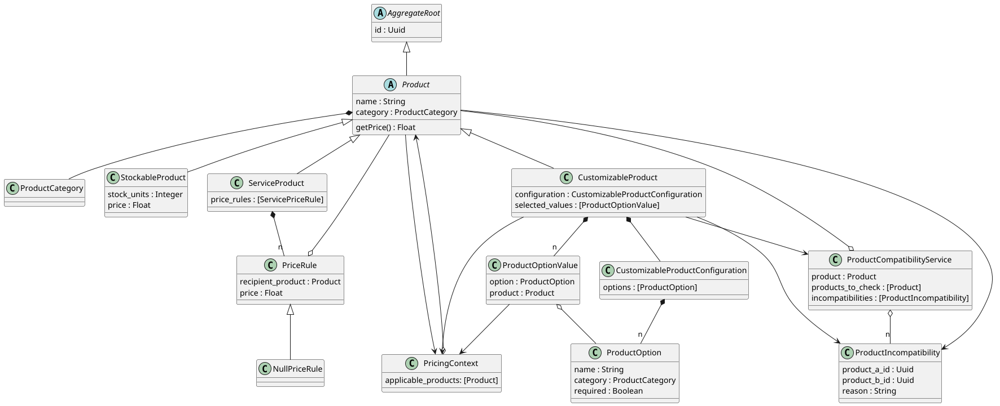
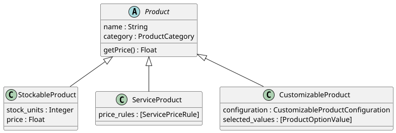
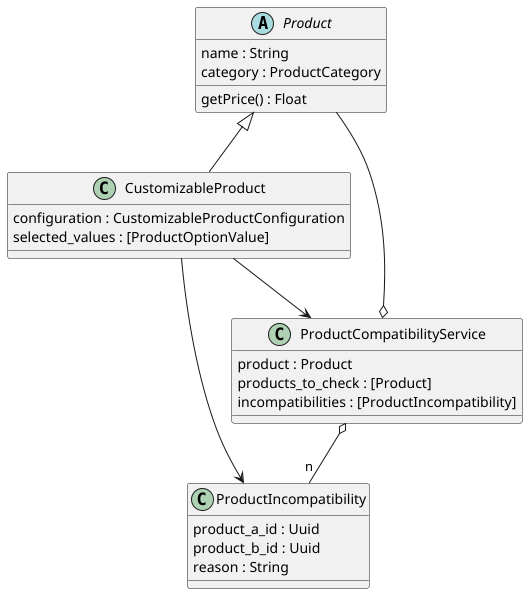

# Factorial Challenge
## Bicycle Shop :bicyclist:

by: [Ismael Calvo](https://www.getmanfred.com/perfil/isma)

--- 

#### Content index:
- [Domain Model](#domain-model)
- [Adding new products](#adding-new-products)
  - [Stockable Product](#stockable-product)
  - [Service Product](#service-product)
  - [Customizable Product](#customizable-product)
    - [Customizable product domain model detail](#customizable-product-domain-model-detail)
- [Setting product incompatibilities](#setting-product-incompatibilities)
  - [Incompatibilities domain model detail](#incompatibilities-domain-model-detail)
- [Pricing](#pricing)
- [Running the app and tests](#running-the-app)

---

## Domain Model


[Domain model UML code](docs/domain_model/domain_model.puml)

In top of the domain model, we have the Product class, which is the base class for all products.  
The Product class is inherited by the other tree classes `StockableProduct`, `ServiceProduct` and `CustomizableProduct`.  
This way we can have a common interface for all products, and we can use polymorphism to handle them in a generic way.
For example, all of them could be sellable, added to the cart or be listed together.



---

## Adding new products
With the product type we can define whether the product is a stockable product, a service or a customizable product.  
We can also add a category.


### Stockable Product
When selecting the 'stockable' the price and stock fields appear.


### Service Product
In the 'service' products we can define pricing rules for the applicable products.


### Customizable Product
For customizable products we can set a bunch of options, picking a product category.  
With this category we will later show the clients the available products of that category, checking first the incompatibilities and available stock.


### Customizable product domain model detail
Each `CustomizableProduct` has a configuration, which has a set of options.  
For each option we set the product category and the requirement.

On the other hand, the set of `ProductOptionValue` will be the products selected by the user.  
It's associated with an option in order to check if each option in the configuration is satisfied.


---

## Setting product incompatibilities
In this section we can set the incompatibilities between products and give a reason for it.


### Incompatibilities domain model detail
We will rely on the service to determine incompatibilities.  
From the customisable product we will check the incompatibilities, although it's intended to be called from any part of the application.



---

## Pricing
Each product will calculate its price, in different ways:
 - `StockableProduct` will have a fixed price
 - `ServiceProduct` will have a price rule table where we can set the price for each product.
 - `CustomizableProduct` will sum the price of each selected product option value.

We will refer to the `PricingContext` to provide additional information.


---

## Running the app
Although it is not a finished solution, it is dockerised and we can run the tests.

### Build and run the project in background
```bash
make build
```

### Run tests and see coverage
```bash
make run-tests
```

### Stop the app
```bash
make stop
```
